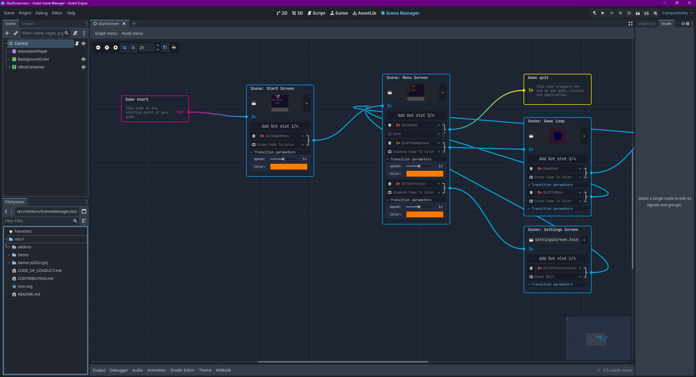

# Godot Scene Manager

> [!IMPORTANT]
> **Beta Version:** This plugin is currently in beta and under active development. Features may change, and bugs may be present. We greatly appreciate your feedback! Please report any issues on our [GitHub Issues page](httpss://github.com/esdg/GodotSceneManager/issues).

**Visually design your game's scene flow.** Godot Scene Manager is a powerful plugin that adds a graph editor for managing scene transitions and relationships. Stop writing boilerplate code and start designing your game's structure with an intuitive drag-and-drop interface.

---

<!-- 
**TODO:** Replace this image with a GIF of the plugin in action!
A good GIF would show:
1. Right-clicking to add a couple of scene nodes.
2. Dragging to connect them.
3. Selecting a transition from the dropdown.
4. Maybe showing the game run with that transition.
-->

---

## 🚀 Key Features

- **Visual Graph Editor**: Design your entire scene flow visually. No more hard-coding scene paths.
- **Drag & Drop Connections**: Create transitions by simply dragging between scene nodes.
- **Rich Transition Library**: Choose from a variety of built-in transitions like fade, cross-fade, slide, and more.
- **Zero/Low-Code**: For many games, especially UI-heavy ones, you can manage all scene changes without writing any code.
- **Built for Godot .NET**: A powerful C# backend ensures robust performance.
- **GDScript Compatible**: Use the plugin in a .NET version of the Godot editor, even if your game is written in GDScript.
- **Open Source (MIT)**: Free to use in any project, commercial or personal.

---

## 📚 Get Started

1.  **[Installation](addons/ScenesManager/Docs/installation.md)**: Download from the Godot Asset Library or GitHub and enable the plugin.
2.  **[Quick Start](addons/ScenesManager/Docs/quick-start.md)**: Follow our guide to create your first scene graph in minutes.
3.  **[Full Documentation](addons/ScenesManager/Docs/README.md)**: Explore all features, transitions, and configuration options.

---

## 🎨 Available Transitions

The Scene Manager includes a comprehensive library of professional transition effects:

### Built-in Transitions
| Transition | Description | Use Case |
|------------|-------------|----------|
| **Fade** | Simple alpha fade | Subtle scene changes |
| **Cross Fade** | Smooth cross-dissolve | General scene changes |
| **Diamond Fade** | Diamond-shaped wipe | Dramatic transitions |
| **Horizontal Curtain** | Side-to-side curtain effect | Menu transitions |
| **Vertical Curtain** | Top-to-bottom curtain effect | Level changes |
| **Chaotic Fade** | Random fragment transition | High-energy scenes |
| **Center Rectangle Zoom Out** | Zooms out from the center with a rectangular shape. | Focusing on a central element. |
| **Circle Zoom** | A circular wipe reveals the next scene. | Modern and clean transitions. |
| **Heart Zoom** | A heart-shaped wipe reveals the next scene. | Romantic or lighthearted scenes. |
| **Pixel Melt** | The scene melts away in pixels. | Glitchy or retro effects. |
| **Pixel Noise** | The scene dissolves into pixelated noise. | Digital or sci-fi transitions. |
| **Radial Fade** | Fades in a circular motion from the center. | Highlighting a central point. |
| **Star Zoom** | A star-shaped wipe reveals the next scene. | Fun and energetic transitions. |

### Color-Enhanced Transitions

| Transition | Description | Customization |
|------------|-------------|---------------|
| **Cross Fade to Color** | Fade through custom color | Configurable overlay color |
| **Diamond Fade to Color** | Diamond transition with color | Color and timing control |
| **Cloud Fade to Color** | Organic cloud-like transition | Color and pattern options |

### Instant Transition
- **Jump Cut**: Immediate scene change without animation (select “none” as transition)

---

## 🤝 Contributing & Porting

We welcome contributions! Whether you're fixing bugs, adding features, or improving documentation, your help makes the plugin better for everyone. See our [Contributing Guidelines](CONTRIBUTING.md) to get started.

As mentioned in Issue [#104](https://github.com/esdg/GodotSceneManager/issues/104), this plugin is currently written in C#. While C# offers great performance and a familiar syntax for many, I recognize that the current lack of C# support for Godot Web (WASM) exports is a limitation for some developers.

Want to port this to GDScript?
I am currently focusing on the C# version, but I am 100% open to a GDScript port! If you would like to translate the logic of this plugin into GDScript, please feel free to do so.

Open Source: This project is licensed under [MIT](LICENSE), so you are free to fork and adapt it.

Credit: If you release a GDScript version, all I ask is a small mention or link back to this original repository.

Collaboration: If you start a port, feel free to open an issue or a Discussion here so we can link to your version and help users find the right tool for their needs.

## 📄 License

**MIT License** - Use freely in personal and commercial projects. See the [LICENSE](LICENSE) file for details.

## 🔗 Links & Support

- **[🏷️ Releases](https://github.com/esdg/GodotSceneManager/releases)** - Download stable versions
- **[🐛 Issues](https://github.com/esdg/GodotSceneManager/issues)** - Report bugs and request features  
- **[💬 Discussions](https://github.com/esdg/GodotSceneManager/discussions)** - Ask questions and share ideas

---

**Made with ❤️ for the Godot Community**

*If this plugin helps your project, consider starring the repository!*

**[⬆ Back to Top](#header)**

