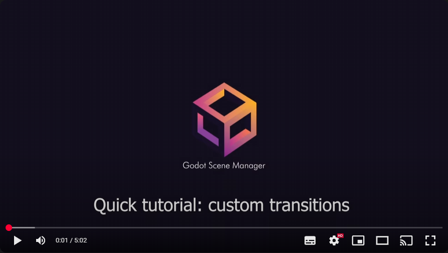

# Transitions Guide

Smoothly switch between scenes with built-in effects or your own custom transitions.

## 🎯 Applying a transition

In the `Scene Manager` tab when editing a schema:
1. Select a Scene Node and click “Add Out slot” (or select an existing one)
2. Choose the signal that triggers the transition
3. Pick a transition from the dropdown (from `res://addons/ScenesManager/TransitionsLibrary/`)
	- Choose “none” for an instant Jump Cut
4. Optionally adjust the per-connection modifiers:
	- Speed (0.0–2.0, default 1.0)
	- Color (only for color-capable transitions)
5. Connect the out slot to a target node

At runtime, when the chosen signal is emitted, the Scene Manager plays the selected transition and switches scenes.

## 🎨 Available Transitions

The Scene Manager includes a comprehensive library of professional transition effects:

### Standard Transitions

| Transition | Description | Use Case | File |
|------------|-------------|----------|------|
| **Cross Fade** | Smooth alpha-based transition | General scene changes | `cross_fade.tscn` |
| **Diamond Fade** | Diamond-shaped wipe effect | Dramatic scene transitions | `diamond_fade.tscn` |
| **Horizontal Curtain** | Side-to-side curtain effect | Menu transitions | `horizontal_cutrain.tscn` |
| **Vertical Curtain** | Top-to-bottom curtain effect | Level changes | `vertical_cutrain.tscn` |
| **Chaotic Fade** | Random fragment transition | Dynamic, energetic scenes | `chaotic_fade.tscn` |

### Color-Enhanced Transitions

| Transition | Description | Customization | File |
|------------|-------------|---------------|------|
| **Cross Fade to Color** | Fade through custom color | Configurable overlay color | `cross_fade_to_color.tscn` |
| **Diamond Fade to Color** | Diamond transition with color | Color and timing control | `diamond_fade_to_color.tscn` |
| **Cloud Fade to Color** | Organic cloud-like transition | Color and pattern options | `cloud_fade_to_color.tscn` |

### Instant Transition

- **Jump Cut**: Immediate scene change without animation (no file needed — select “none”)

## Transition Effects Library

All transition files are located in `addons/ScenesManager/TransitionsLibrary/`:

```
TransitionsLibrary/
├── cross_fade.tscn
├── cross_fade_to_color.tscn
├── diamond_fade.tscn
├── diamond_fade_to_color.tscn
├── chaotic_fade.tscn
├── cloud_fade_to_color.tscn
├── horizontal_cutrain.tscn
└── vertical_cutrain.tscn
```

Notes:
- Color parameter applies to the “to_color” variants (and other color-capable transitions)
- Non-color transitions ignore the color modifier
- Speed applies to all animation-based transitions

## Choosing the Right Transition

### By Scene Type

**Menu Screens**:
- Cross Fade - Clean, professional
- Horizontal Curtain - Sliding effect
- Jump Cut - Instant response

**Game Levels**:
- Diamond Fade - Dramatic entry/exit
- Vertical Curtain - Top-down reveal
- Cross Fade to Color - Thematic color transitions

**Action Sequences**:
- Chaotic Fade - High energy
- Diamond Fade - Sharp, decisive
- Jump Cut - Immediate impact

**Narrative Moments**:
- Cross Fade to Color - Mood setting
- Cloud Fade to Color - Organic, flowing
- Cross Fade - Gentle progression

### By Game Genre

**Puzzle Games**: Cross Fade, Jump Cut
**Action Games**: Chaotic Fade, Diamond Fade
**RPGs**: Cross Fade to Color, Cloud Fade to Color
**Arcade Games**: Diamond Fade, Vertical Curtain
**Story Games**: Cross Fade, Cross Fade to Color

## Creating Custom Transitions

While the plugin comes with 8 built-in transitions, you can create custom effects by:

1. **Studying existing transitions** in the TransitionsLibrary folder
2. **Creating new scene files** following the same structure
3. **Using the transition base classes** provided by the plugin
4. **Adding your custom transitions** to the TransitionsLibrary folder

### Video Tutorial

[](https://studio.youtube.com/video/jBtL-dk0BqU/edit)


### Transition Structure (checklist)

Create a new `.tscn` in `res://addons/ScenesManager/TransitionsLibrary/`:
- Root node extends `TransitionNode` (or `TransitionNodeWithColor` for color overlay support)
- Provide an `AnimationPlayer` with a `TRANSITION` animation; if missing, `TransitionNode` creates a sensible default
- Let the base class handle scene containers and SubViewports (no extra setup required)
- For color support, bind a `ColorRect` to `TransitionNodeWithColor` and the color modifier will be applied
- Keep filenames stable once used in schemas; renaming requires updating connections

## Best Practices

### Performance Tips
- Use simpler transitions (Cross Fade, Jump Cut) for complex scenes
- Test transitions on target platforms for performance
- Consider using Jump Cut for rapid scene changes
- Keep transition scenes lightweight (textures, effects)

### Visual Design
- Match transition style to your game's aesthetic
- Use color-based transitions to reinforce themes
- Consider the emotional impact of different transition types

### User Experience
- Don't overuse dramatic transitions - they can become distracting
- Ensure transitions feel responsive, not sluggish
- Use consistent transition types for similar scene changes
- Provide instant options (Jump Cut) for impatient players

## 🛠️ Troubleshooting transitions

- Transition doesn’t play: ensure a file is selected (or “none” for Jump Cut) and the filename exists in `TransitionsLibrary`
- No color effect: verify you’re using a color-capable transition (e.g., `*_to_color.tscn`)
- Too slow/fast: adjust the Speed modifier on the connection
- Errors in Output panel: correct missing files or invalid schema paths; see [Troubleshooting](troubleshooting.md)